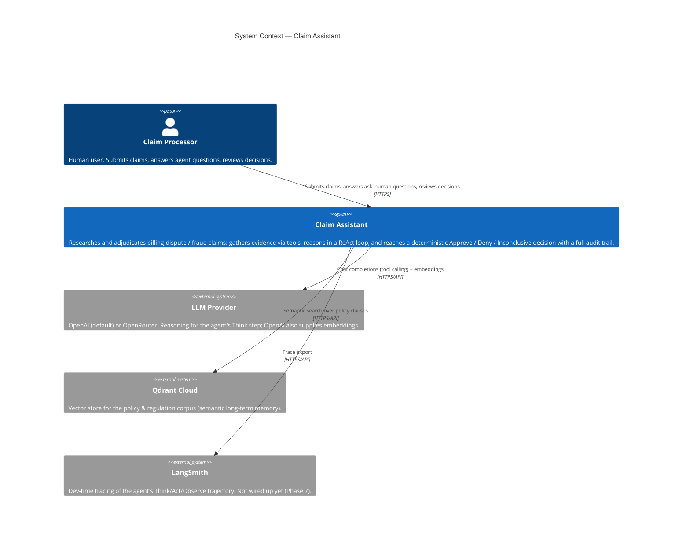
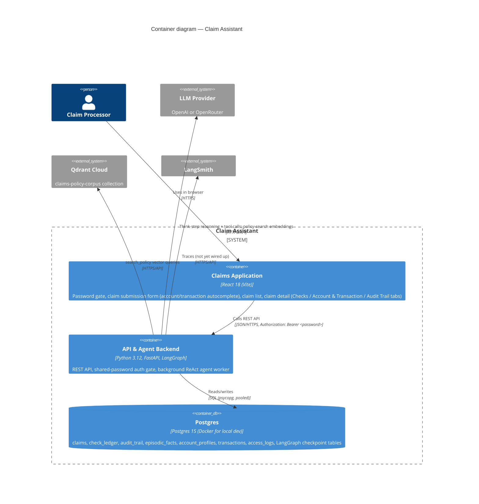
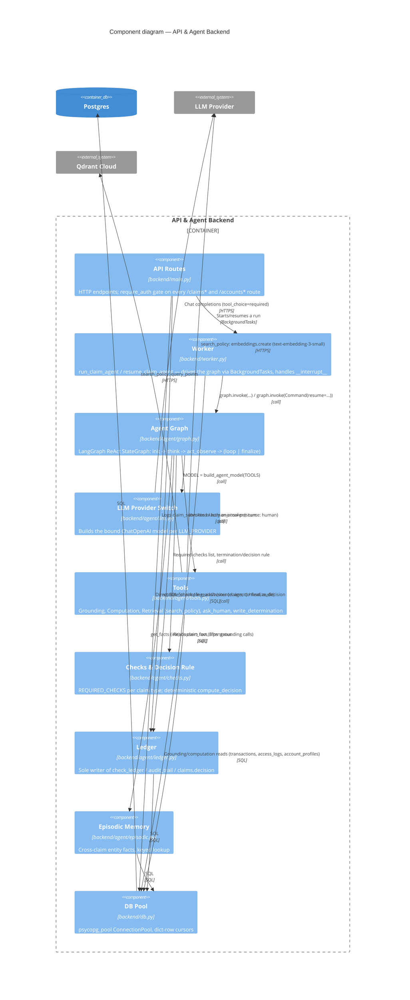
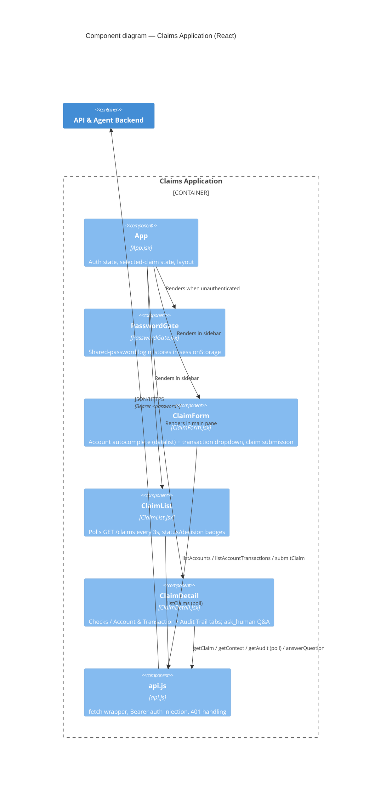
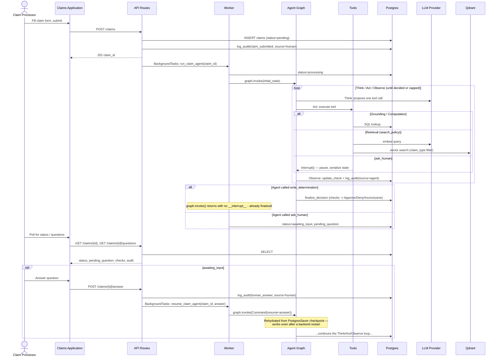

# Claim Assistant — C4 Architecture

Companion to [`specs/requirements.md`](../specs/requirements.md) and
[`specs/technical.md`](../specs/technical.md). Those documents carry the *why* behind
each choice (alternatives considered, tradeoffs); this document is the *map* —
[C4 model](https://c4model.com/) diagrams of the system at increasing zoom, kept in
sync with the code rather than the plan. Diagrams render as
[Mermaid](https://mermaid.js.org/) — GitHub, most IDEs (incl. VS Code with a Mermaid
extension), and any Mermaid-aware Markdown viewer render them inline.

Reflects the system as of 2026-08-16 (Qdrant as the vector store, OpenAI/OpenRouter as
switchable LLM providers — see `specs/tracker.md` Phase 3 and the LLM-provider note in
Phase 5 for how it got here).

---

## Level 1 — System Context

Who uses Claim Assistant, and what external systems does it depend on.

**Notes**

- There is exactly one human role (`Claim Processor`) — no separate admin/reviewer
  role exists; auth is a single shared password (`technical.md`'s Auth row), not
  per-user accounts.
- `LLM Provider` is drawn as one external system because the app only ever talks to
  one at a time — `LLM_PROVIDER` in `.env.local` picks OpenAI or OpenRouter
  (`backend/agent/llm.py`); embeddings (`text-embedding-3-small`) always go to OpenAI
  regardless of that switch, since Qdrant's collection dimension/relevance-floor
  calibration is pinned to that specific model.
- LangSmith is shown because it's a confirmed architectural dependency
  (`technical.md`'s Observability row) even though it isn't wired into the code yet —
  Phase 7 in `specs/tracker.md` is still open.

---

## Level 2 — Containers

The deployable/runnable units inside Claim Assistant, and how they talk to each other.

**Notes**

- Local dev: Vite serves the SPA on `:5173`, uvicorn serves the API on `:8000`,
  `CORSMiddleware` in `backend/main.py` bridges the cross-origin gap
  (`scripts/start.sh` brings all three up together). Production (`specs/tracker.md`
  Phase 9, not yet done): Nginx serves the built SPA and reverse-proxies `/api` to
  uvicorn same-origin, so CORS stops mattering.
- "API & Agent Backend" is one container, not two, because the background agent
  worker (`backend/worker.py`) runs in-process via FastAPI `BackgroundTasks` — no
  separate worker process or task queue (`technical.md`'s Background Execution row:
  Celery/RQ was rejected as unjustified at this scale).
- Postgres is also LangGraph's checkpoint store (`PostgresSaver`), not just the
  application database — that's what lets a claim paused on `ask_human` survive a
  backend restart and resume correctly hours or days later.

---

## Level 3 — Components (API & Agent Backend)

The backend container is where nearly all the interesting behavior lives. This is a
zoom into its internal modules.

**Notes**

- **`ledger.py` is the single write path** for `check_ledger`, `audit_trail`, and
  `claims.decision` — both `graph.py` (agent-sourced events) and `main.py` (the two
  human-sourced events, `claim_submitted` and `human_answer`) call into it rather than
  writing SQL directly, which is what makes every audit row's `source: "agent"|"human"`
  attribution reliable (`specs/requirements.md` §11).
- **`checks.py` is the only place a decision is computed.** The LLM never asserts
  Approve/Deny/Inconclusive — `write_determination` is a tool with no decision payload;
  calling it only triggers `finalize_node`, which calls `ledger.finalize_decision`,
  which calls `checks.compute_decision` on the check ledger's actual PASS/FAIL/BLOCKED
  state (`specs/requirements.md` §6).
- **`tools.py` talks to three different stores**: Postgres directly (grounding/
  computation tools), Qdrant (semantic search), and the LLM provider (embeddings for
  that search — always OpenAI, independent of `LLM_PROVIDER`).
- Endpoints not shown individually above (they all route through `routes` →
  `dbC`/`worker`/`ledgerC`): `POST /claims`, `GET /claims`, `GET /claims/{id}`,
  `GET /claims/{id}/context`, `GET /claims/{id}/audit`, `GET /claims/{id}/questions`,
  `POST /claims/{id}/answer`, `GET /claims/{id}/decision`, `GET /accounts`,
  `GET /accounts/{id}/transactions`.

### Frontend components (Claims Application), for completeness

---

## Level 4 — Dynamic view: a claim's lifecycle

Not a C4 "Code" diagram (there's no class hierarchy complex enough to warrant one) —
instead, the runtime sequence that the container/component diagrams above don't show:
how a claim moves through the system, including the `ask_human` pause/resume that
motivates several of the architectural choices above (Postgres-backed checkpointing,
background-task execution, polling-based `ask_human` channel).

---

## Scope & maintenance

This document is the structural map; it deliberately does **not** repeat the
decision rationale already in `specs/technical.md` (tech-choice table with
alternatives considered) or the requirement-level "why" in `specs/requirements.md`.
When either changes in a way that moves a box or an arrow — a new container, a
component split apart, a dependency swapped (as Pinecone → Qdrant was) — update the
relevant diagram(s) here too, the same way `specs/tracker.md` is kept current against
the actual implementation.
