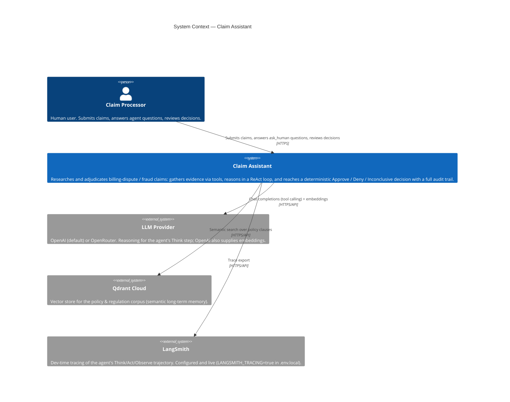
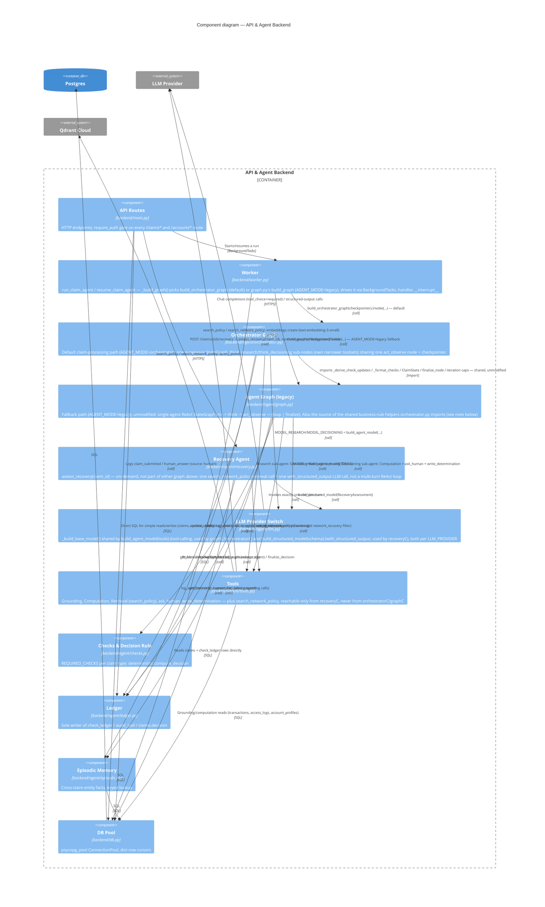
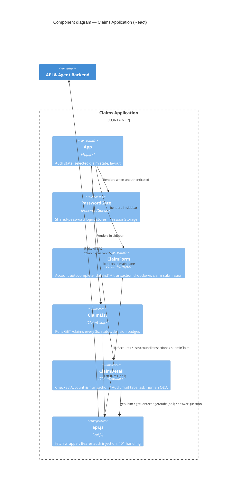
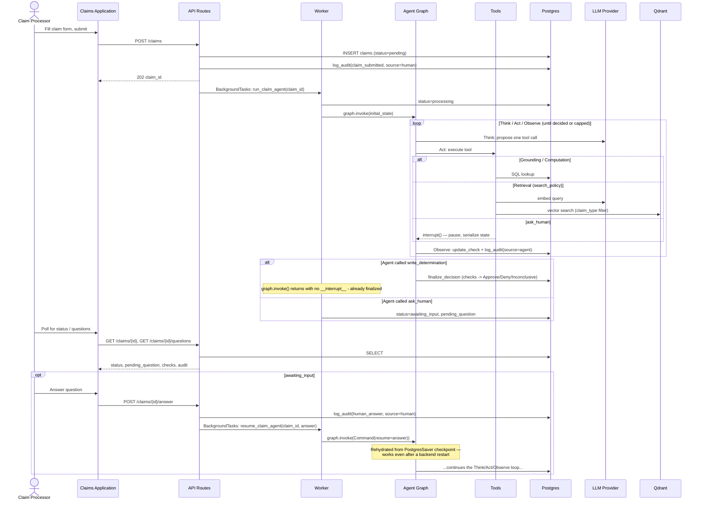
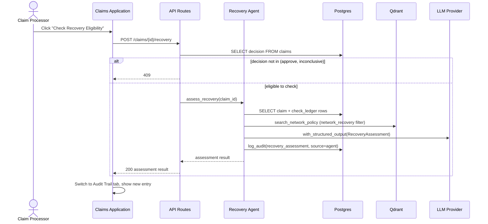

# Claim Assistant — C4 Architecture

Companion to [`specs/requirements.md`](../specs/requirements.md) and
[`specs/technical.md`](../specs/technical.md). Those documents carry the *why* behind
each choice (alternatives considered, tradeoffs); this document is the *map* —
[C4 model](https://c4model.com/) diagrams of the system at increasing zoom, kept in
sync with the code rather than the plan. Diagrams render as
[Mermaid](https://mermaid.js.org/) — GitHub, most IDEs (incl. VS Code with a Mermaid
extension), and any Mermaid-aware Markdown viewer render them inline.

Reflects the system as of 2026-08-17 (Qdrant as the vector store, OpenAI/OpenRouter as
switchable LLM providers — see `specs/tracker.md` Phase 3 and the LLM-provider note in
Phase 5 for how it got here — plus Phase 7's refactor: `backend/agent/orchestrator.py`'s
Research/Decisioning supervisor graph is now the default claim-processing path
(`AGENT_MODE=orchestrator`), the on-demand Recovery agent
(`backend/agent/recovery.py`, `POST /claims/{id}/recovery`) was added, and LangSmith
tracing (Level 1/2) is now actually configured and live, not just a planned
dependency).

---

## Level 1 — System Context

Who uses Claim Assistant, and what external systems does it depend on.

**Notes**

- There is exactly one human role (`Claim Processor`) — no separate admin/reviewer
  role exists; auth is a single shared password (`technical.md`'s Auth row), not
  per-user accounts.
- `LLM Provider` is drawn as one external system because the app only ever talks to
  one at a time — `LLM_PROVIDER` in `.env.local` picks OpenAI or OpenRouter
  (`backend/agent/llm.py`); embeddings (`text-embedding-3-small`) always go to OpenAI
  regardless of that switch, since Qdrant's collection dimension/relevance-floor
  calibration is pinned to that specific model.
- LangSmith is shown as a dev-time observability dependency (`technical.md`'s
  Observability row) — distinct from the `audit_trail` table, which is the permanent
  system-of-record audit log. It's now configured (`.env.local`'s
  `LANGSMITH_TRACING`/`LANGSMITH_API_KEY`/`LANGSMITH_ENDPOINT`/`LANGSMITH_PROJECT`,
  loaded by `backend/db.py`'s `load_dotenv()` before any LLM calls run) and tracing is
  live — LangChain/LangSmith auto-instrument from those env vars alone, no application
  code required.
- The Recovery agent's network-chargeback-recovery question ("can the bank recover
  funds from the card network for an already-decided claim") is a materially different
  question from claim adjudication, but is left out of this System Context diagram to
  keep it coarse-grained — see Level 2/3 for where it enters (`backend/agent/recovery.py`,
  `POST /claims/{id}/recovery`).

---

## Level 2 — Containers

The deployable/runnable units inside Claim Assistant, and how they talk to each other.

**Notes**

- Local dev: Vite serves the SPA on `:5173`, uvicorn serves the API on `:8000`,
  `CORSMiddleware` in `backend/main.py` bridges the cross-origin gap
  (`scripts/start.sh` brings all three up together). Production (`specs/tracker.md`
  Phase 10, not yet done): Nginx serves the built SPA and reverse-proxies `/api` to
  uvicorn same-origin, so CORS stops mattering.
- "API & Agent Backend" is one container, not two, because the background agent
  worker (`backend/worker.py`) runs in-process via FastAPI `BackgroundTasks` — no
  separate worker process or task queue (`technical.md`'s Background Execution row:
  Celery/RQ was rejected as unjustified at this scale).
- Postgres is also LangGraph's checkpoint store (`PostgresSaver`), not just the
  application database — that's what lets a claim paused on `ask_human` survive a
  backend restart and resume correctly hours or days later.
- The on-demand Recovery agent (`POST /claims/{id}/recovery`, Phase 7) lives in this
  same "API & Agent Backend" container — it's a single retrieval call + one
  `with_structured_output` LLM call that runs synchronously in the request/response
  cycle, not via `BackgroundTasks`, since it's a few seconds of work rather than a
  multi-minute agent loop.

---

## Level 3 — Components (API & Agent Backend)

The backend container is where nearly all the interesting behavior lives. This is a
zoom into its internal modules.

**Notes**

- **`ledger.py` is the single write path** for `check_ledger`, `audit_trail`, and
  `claims.decision` — `graph.py` and `orchestrator.py` (agent-sourced events),
  `recovery.py` (`recovery_assessment` events), and `main.py` (the two human-sourced
  events, `claim_submitted` and `human_answer`) all call into it rather than writing
  SQL directly, which is what makes every audit row's `source: "agent"|"human"`
  attribution reliable (`specs/requirements.md` §11).
- **`checks.py` is the only place the core Approve/Deny/Inconclusive decision is
  computed**, and it's shared, not duplicated: the LLM never asserts a decision —
  `write_determination` is a tool with no decision payload; calling it only triggers
  `finalize_node` (defined once, in `graph.py`), which calls `ledger.finalize_decision`,
  which calls `checks.compute_decision` on the check ledger's actual PASS/FAIL/BLOCKED
  state (`specs/requirements.md` §6). `orchestrator.py` imports `finalize_node`
  directly rather than reimplementing it — along with `_derive_check_updates`,
  `_format_checks`, `ClaimState`, and the iteration caps — specifically so the
  check-ledger/decision rules can never drift between the legacy and orchestrator
  paths. The Recovery agent's `eligible` judgment is a deliberate, scoped exception to
  this pattern: it's an LLM-judged, advisory output, not a run through `checks.py`
  (`specs/technical.md` §5).
- **`tools.py` talks to three different stores**: Postgres directly (grounding/
  computation tools), Qdrant (semantic search — `search_policy` for the main
  claim-processing loop, `search_network_policy` exclusively for `recoveryC`), and the
  LLM provider (embeddings for that search — always OpenAI, independent of
  `LLM_PROVIDER`).
- **`orchestrator.py` vs `graph.py`**: `orchestrator.py` is new code for the
  supervisor's `act_observe_node` and its two think-nodes (they needed
  sub_agent-tagging/role-switching logic the legacy loop doesn't have), so there's
  deliberate duplication of the tool-execution loop *shape* between the two files —
  but the business rules inside it (check derivation, formatting, decision
  finalization, iteration caps) are imported, not copied.
- **`recovery.py` is a one-shot judgment, not a ReAct loop**: one retrieval call
  (`search_network_policy`) feeds one `with_structured_output` call
  (`RecoveryAssessment` schema) — no tool-calling turns, no checkpointing, no
  `ask_human`. It runs synchronously inside the `POST /claims/{id}/recovery` request.
- Endpoints not shown individually above (they all route through `routes` →
  `dbC`/`worker`/`ledgerC`/`recoveryC`): `POST /claims`, `GET /claims`,
  `GET /claims/{id}`, `GET /claims/{id}/context`, `GET /claims/{id}/audit`,
  `GET /claims/{id}/questions`, `POST /claims/{id}/answer`, `GET /claims/{id}/decision`,
  `POST /claims/{id}/recovery`, `GET /accounts`, `GET /accounts/{id}/transactions`.

### Frontend components (Claims Application), for completeness

---

## Level 4 — Dynamic view: a claim's lifecycle

Not a C4 "Code" diagram (there's no class hierarchy complex enough to warrant one) —
instead, the runtime sequence that the container/component diagrams above don't show:
how a claim moves through the system, including the `ask_human` pause/resume that
motivates several of the architectural choices above (Postgres-backed checkpointing,
background-task execution, polling-based `ask_human` channel).

**Since Phase 7**, `G` ("Agent Graph") in the loop above is `orchestratorC` by default
(`AGENT_MODE=orchestrator`), not `graphC` — but the externally-visible sequence shape is
unchanged: `graph.invoke`/`Command(resume=...)`, one shared `act_observe`, the same
pause/resume/checkpoint mechanics. What changes internally is that "Think" now covers
two distinct roles sharing this same loop shape — a Research turn (Grounding + Retrieval
tools only) followed by a Decisioning turn (Computation + `ask_human` +
`write_determination`) — with a supervisor deciding after each `act_observe` round which
role goes next (research-owned checks resolved, or its iteration budget exhausted, hands
off to Decisioning permanently). `ask_human` is only ever proposed during a Decisioning
turn, since Research has no access to that tool.

### Recovery agent — separate, on-demand sequence

A materially different interaction shape from the loop above: synchronous, one-shot, no
pause/resume, no checkpointing. Triggered only after a claim already has a decision.

---

## Scope & maintenance

This document is the structural map; it deliberately does **not** repeat the
decision rationale already in `specs/technical.md` (tech-choice table with
alternatives considered) or the requirement-level "why" in `specs/requirements.md`.
When either changes in a way that moves a box or an arrow — a new container, a
component split apart, a dependency swapped (as Pinecone → Qdrant was) — update the
relevant diagram(s) here too, the same way `specs/tracker.md` is kept current against
the actual implementation.
