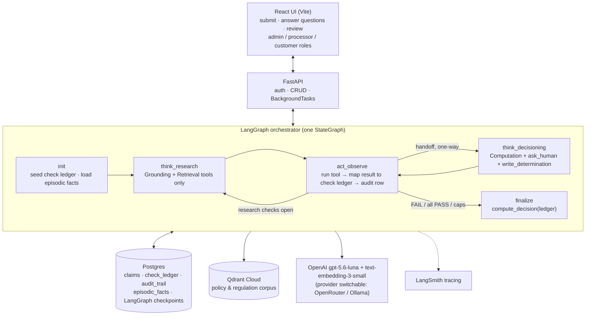

<!--
Final Capstone Report — slide deck source.
One slide per `---`-delimited section; `##` is the slide title.
Follows the section layout in reqs/presentation.md. Convert to PowerPoint with
Marp / Pandoc / reveal.js, or copy slide-by-slide.
-->

# Claim Assistant
### An autonomous, audit-grade agent for adjudicating billing-dispute and fraud claims

Paritosh Mathur · Final Capstone Project · September 2026
Repo: https://github.com/mathurparitosh/agentic-claim-processing

---

## Problem & User

**The problem.** A claim processor adjudicating a billing-dispute or fraud claim must
cross-reference several independent systems — transaction history, account red-flag
data, system/access logs, and the current policy & regulation text — then reach an
Approve / Deny decision that is **grounded and citable** because it is subject to
internal and external audit.

- The right research path is only known **after** reading the claim (it depends on the claim type).
- Each step's result determines the next step — it is inherently **iterative**, not one-shot.
- The processor must know when there is **enough** evidence to decide — and recognise when there is **not**, and ask, rather than guess.

**Intended user.** The **Claim Processor** — reviews the agent's decision, answers
questions when asked, and remains the accountable human in the loop.

**Why it matters.** Manual research is slow and inconsistent; a bad Approve pays a
fraudulent claim, a bad Deny wrongs a customer, and either is indefensible in audit if
the reasoning was not recorded. The same *research → verify → decide* pattern also
covers underwriting, KYC review, and compliance case review.

---

## System Goal & Scope

**Goal.** Automate the research-and-decide loop: read a claim, determine which checks
apply, autonomously gather evidence via tools, and either render **Approve / Deny** or
report **Inconclusive** with the specific reason evidence could not be completed.

**What "successful performance" looks like**
- Correct decision **and** correct path — the right checks resolved the right way, not just the right final label.
- Every decision reconstructable from the audit trail alone, with a policy citation where one applies.
- The agent escalates or fails safe under uncertainty — it never guesses an outcome.

**Scope & boundaries (deliberate constraints)**
- Two claim types only: `billing_dispute`, `fraud` — 4 required checks each.
- The Approve/Deny/Inconclusive outcome is **computed from a check ledger by fixed rules**, never emitted as free-form model text.
- Only a **tool result or a human answer** may close a check; model inference can only choose the next action.
- Bounded run: ≤ 12 iterations, ≤ 3 human questions — every run terminates.
- Synthetic evidence data; policy corpus is a fixed markdown set (no live document store).

---

## Final System Architecture — overview

Everything runs on one Ubuntu VM: Nginx serves the built React app and proxies `/api`
to a systemd/uvicorn FastAPI process; Postgres is local; Qdrant, OpenAI and LangSmith
are external.

---

## Architecture — the reasoning loop and the check ledger

**ReAct (Think → Act → Observe), not Tree-of-Thought.**
- The next step is *"resolve a still-UNKNOWN check"*, not a choice among competing strategies — there is rarely a real branch point.
- Evidence must accumulate **linearly and auditably** — a single ordered trace maps directly onto the audit-trail requirement; a branching search does not.
- Termination is *"the fixed set of checks is exhausted"*, not search convergence.

**The check ledger is the external source of truth.**
- Each required check is `PASS` / `FAIL` / `UNKNOWN` / `BLOCKED`.
- `act_observe` maps each tool result onto the ledger by fixed business rules — the model never writes the ledger directly.
- `finalize` runs `compute_decision(ledger)`: any `FAIL` → **Deny** (short-circuits), any `UNKNOWN`/`BLOCKED` → **Inconclusive**, all `PASS` → **Approve**.

**Boundedness.** `MAX_ITERATIONS = 12`, `NO_PROGRESS_LIMIT = 5`, `HUMAN_QUESTION_BUDGET = 3`,
research-phase cap = *(research checks in this claim)* + 2 — all force a clean
Inconclusive with a named unresolved check rather than an unbounded run.

---

## Architecture — memory, tools, and retrieval

**Memory (the cognitive triad, each mapped to a real store)**
| Type | Holds | Store |
|---|---|---|
| Short-term — agent state | Think/Act/Observe transcript for the in-progress claim; survives an `ask_human` pause | LangGraph `PostgresSaver` checkpoint |
| Short-term — check state | Structured PASS/FAIL/UNKNOWN/BLOCKED per check | `check_ledger` table |
| Long-term — semantic | Policy & regulation corpus | Qdrant (similarity search) |
| Long-term — episodic | Per-account facts, provenance-tagged, reused across claims | `episodic_facts` table (keyed lookup) |

**Tools — each category answers a specific LLM limitation**
- **Grounding:** `lookup_transaction`, `lookup_account_profile`, `lookup_access_logs`
- **Computation:** `check_duplicate_charge`, `check_transaction_anomaly` (date math / anomaly scoring — LLMs are unreliable here)
- **Retrieval:** `search_policy` (semantic search over the corpus, for citations)
- **`ask_human`:** last-resort retrieval — suspends the run
- **`write_determination`:** the *single* irreversible write, isolated as the last action; its return value is advisory only

**RAG design.** 114 clause-level chunks (one per policy provision, never split);
retrieve top **k=20 → relevance floor 0.5 → top 3**; hard-filter by `claim_type` so a
wrong-type clause can't ground a decision; **zero results is an honest outcome** ("no
matching policy found" → `BLOCKED`), not a forced weak match. The full retrieval trace
(query, filter, all 20 candidates + scores) goes to the audit trail.

---

## Architecture — multi-agent coordination, guardrails, HITL

**Two sub-agents, disjoint tool sets, one supervisor graph**
- **Research** holds only read-only lookups + `search_policy` — it gathers evidence and never judges.
- **Decisioning** holds the Computation tools, `ask_human`, and `write_determination` — the two safety-relevant tools are **unreachable during evidence gathering**.
- Handoff Research → Decisioning is **one-way**, with an explicit role-switch message; counters stay **global** so the boundary isn't a loophole around the caps.

**Recovery agent (separate, on-demand, advisory).** After a claim reaches
`approve`/`inconclusive`, a processor can trigger a card-network recovery assessment —
one retrieval call + one structured-output LLM call, gated in code, writes a single
advisory audit row. Never touches the system-of-record decision.

**Guardrails — a gate at every junction of the loop**
- Input: bearer auth + Pydantic validation; `claim_type` from a fixed set; `reason` from a dropdown.
- Source: `claim_type` hard-filter + relevance floor on retrieval.
- Tool exec: unknown-tool guard + `try/except` on every call → structured error back to the model, not a crash.
- Output: outcome computed from the ledger; only tool/human facts close a check.
- Runtime: hard caps; append-only audit row per step; Postgres checkpoint per super-step.

**Human-in-the-loop.** `ask_human` suspends the run (`awaiting_input`); it resumes from
its checkpoint on the answer, even across a process restart. An ambiguous answer keeps
the check `UNKNOWN` (→ Inconclusive) rather than guessing.

---

## Design evolution — Modules 1–3

| Module | Focus | What changed, and why it helped |
|---|---|---|
| **M1 — Foundations** | Problem framing, model & stack choice | Framed the task as *research → verify → decide*. Chose **ReAct over Tree-of-Thought** (linear trace = audit trail; closed checklist, not a search). Locked the stack for the properties it buys: **LangGraph** (checkpointed loop), **Postgres from day one** (concurrent ledger writes, no migration), **Qdrant**, **OpenAI**. Wrote the four non-functional requirements — traceability, resumability, determinism, boundedness — as the spec everything else is measured against. |
| **M2 — Agent architecture (memory, tools, loops)** | The loop, the ledger, memory | Built the **check ledger as an external source of truth** so the decision is computed, not spoken. Short-term memory split in two: **checkpointer** (transcript, survives the `ask_human` pause) + **ledger table** (structured check state). Added **episodic memory** — provenance-tagged per-account facts reused across claims. Tool layer organised by the LLM limitation each category addresses (Grounding / Computation / Retrieval). |
| **M3 — RAG & vector databases** | Grounding decisions in current policy | **Clause-boundary chunker** (one provision per chunk, never split) instead of fixed-size. Migrated Pinecone → **Qdrant**. Added a **`claim_type` hard-filter** so a lexically-similar wrong-type clause can't ground a decision. **Recalibrated the relevance floor 0.75 → 0.5** after real cosine scores showed 0.75 was silently discarding *every* correct match. Made **"zero results" a first-class honest outcome** and logged the full retrieval trace for audit. |

---

## Design evolution — Modules 4–6

| Module | Focus | What changed, and why it helped |
|---|---|---|
| **M4 — Tool discipline & grounding** | Making the agent trustworthy per step | Enforced **only tool- or human-verified facts close a check** — model inference can *only* pick the next action. **Removed a tool** that let the model supply a policy filing-window day-count directly (it invented `window_days = 60` and never called retrieval); retrieval-only checks can now close *only* via a real retrieval hit. `tool_choice="required"` + `parallel_tool_calls=False` → exactly one action per turn. Tool-execution error guard so a malformed call ends Inconclusive, never a 500 that strands the claim. |
| **M5 — Multi-agent coordination** | Separating "gather" from "decide" | Split the single agent into **Research** (read-only) + **Decisioning** (compute / escalate / write) with **disjoint tool sets** in one supervisor graph — the split matters because the two halves have different, safety-relevant tool access. Added a separate **on-demand Recovery agent** (advisory, retrieval-grounded). Found & fixed a routing bug: a research check with no tool path looped until the *global* no-progress cap before Decisioning — and therefore `ask_human` — ever ran; added a research-phase iteration budget so it hands off and escalates. |
| **M6 — Evaluation, guardrails, logging, observability** | Proving the constraints hold | Built a **10-claim stratified eval set** with predetermined outcomes, run through the live graph, diffing the decision **and every check's status + detail** — catches "right answer, wrong reasoning". Wired **LangSmith** tracing. Formalised the **append-only audit trail** with agent/human attribution + model/provider per row. Wrote a **safety plan** (risk register R1–R10, gate-at-every-junction guardrails, router-not-gate HITL). Added an **in-app tracing UI** (Context / Memory / Sub-agents tabs) and **admin / processor / customer roles**. |

---

## Implementation Overview

**Frontend** — React + Vite SPA. Claims list, submission form, per-claim detail
(Checks · Account & Transaction · Audit Trail; admin also sees Context · Memory ·
Sub-agents), and an admin-only Agent tab (tool catalog + the compiled graph rendered
with Mermaid). Polls for status and pending `ask_human` questions.

**Backend** — Python + **FastAPI**. `BackgroundTasks` runs the agent loop off the
request thread so the UI can poll immediately; no queue/broker at this scale.
Shared-password bearer auth; `X-Username` header selects role
(`admin`/`processor`/`customer`), and a customer is scoped to claims they filed.

**Agent** — **LangGraph** `StateGraph`: `init → think_research → act_observe →
(loop | think_decisioning) → act_observe → finalize`. **`PostgresSaver`** checkpoints
every super-step so a paused run resumes across a restart.

**Models & APIs** — OpenAI **`gpt-5.6-luna`** for the Think step (via the Responses
API, to keep reasoning + tool-calling), **`text-embedding-3-small`** for retrieval.
Provider is switchable to **OpenRouter** or a local **Ollama** model via one env var.

**Retrieval** — **Qdrant Cloud**; custom clause-boundary chunker over the markdown
policy corpus; `claim_type`-filtered query, relevance floor, top-3.

**Data** — **Postgres**: `claims`, `check_ledger`, `audit_trail`, `episodic_facts`,
synthetic `transactions` / `access_logs` / `account_profiles`, plus LangGraph's
checkpoint tables. Synthetic evidence is LLM-generated, then mechanically checked
against each scenario's `expect` block before loading.

**Observability** — **LangSmith** (dev tracing) + the Postgres audit trail (compliance
system of record) — deliberately kept separate.

---

## Evaluation — method

**Seed set: 10 predetermined claims** (`specs/eval_claims.md`), written **before** any
evidence was generated. Spans:
- both claim types — **6 fraud / 4 billing_dispute**
- four evidence-completeness levels — **clean**, **unfounded** (claim doesn't hold up), **incomplete** (a fact has no tool path → forces `ask_human`), **irresolvable** (human answer is ambiguous too)
- outcomes — **4 Approve / 5 Deny / 1 Inconclusive** (deliberately Deny-heavy, so the FAIL / short-circuit / forced-Inconclusive paths are actually exercised)

**Harness** — `backend/eval_notebook.ipynb` inserts each claim, runs it through the
**live orchestrator graph**, auto-answers `ask_human` from a fixed per-scenario script,
then diffs against ground truth on **two axes**:
1. `decision` exact match
2. **every check's `status` *and* `detail`** — so "right answer, wrong reasoning" fails the eval

**Criteria tracked** — decision accuracy, path/trace correctness, groundedness (every
closed check traces to a tool result or human answer), citation coverage, safety /
short-circuit correctness (no seeded Deny ever Approves), fallback success (forced
Inconclusive names the unresolved check), termination.

---

## Evaluation — results

**10 / 10 claims matched their predetermined decision *and* full check-ledger detail**
on the first fully-passing run (~100 s wall-clock for all 10).

| # | Account | Type | Completeness | Expected | Mechanism |
|---|---|---|---|---|---|
| 1 | ACC-9001 | fraud | clean | **Approve** | anomaly + risk-flagged access log + standing good + policy hit → 4× PASS |
| 2 | ACC-9002 | billing | clean | **Approve** | real near-duplicate pair found → 4× PASS |
| 3 | ACC-9003 | fraud | clean | **Approve** | same shape as #1, independent scenario |
| 4 | ACC-9004 | fraud | unfounded | **Deny** | `standing = suspended` → `account_red_flags` FAIL → short-circuit |
| 5 | ACC-9005 | billing | unfounded | **Deny** | no matching duplicate exists → `duplicate_charge_check` FAIL |
| 6 | ACC-9006 | fraud | incomplete | **Approve** | no profile row → `ask_human` → "yes" → PASS; others PASS on their own |
| 7 | ACC-9007 | billing | incomplete | **Deny** | no profile row → `ask_human` → "no" → FAIL overrides 2 passing checks |
| 8 | ACC-9008 | billing | invalid | **Deny** | disputed txn doesn't exist → `transaction_exists` FAIL |
| 9 | ACC-9009 | fraud | unfounded | **Deny** | ordinary transaction → anomaly + access-log checks both FAIL |
| 10 | ACC-9010 | fraud | irresolvable | **Inconclusive** | ambiguous human answers → `account_red_flags` stays UNKNOWN → caps hit, reason names the check |

**One real agent bug found via the eval** (not a scenario error): `ask_human` answer
parsing matched a raw string prefix, so `"not sure…"` matched `startswith("no")` and
wrongly Denied #10. Fixed to match the first whitespace-delimited word; #10 then
correctly landed Inconclusive. Re-ran all 10 → still 10/10.

---

## Safety & Reliability Considerations

**Thesis — the decision is on deterministic rails, the reasoning is on disk.**
`compute_decision()` over the ledger means the model *cannot* assert an outcome; the
append-only audit trail means every run is reconstructable without model memory.

**Guardrails (defense in depth — no single control is load-bearing)**
- **Role split:** `ask_human` and `write_determination` are unreachable during evidence gathering.
- **One action per turn:** `tool_choice="required"`, `parallel_tool_calls=False`.
- **Source verification:** `claim_type` hard-filter + relevance floor; wrong-type retrieval rate enforced to 0.
- **Tool-execution guard:** malformed / failing tool call → structured error to the model → run continues, can still end Inconclusive.
- **Decision integrity:** only a tool result or human answer moves a check to PASS/FAIL.
- **Boundedness:** iteration / no-progress / question caps guarantee termination.

**Monitoring & logging.** Append-only `audit_trail` row per step (`run_started`,
`agent_think`, `tool_call`, `human_answer`, `determination_written`,
`recovery_assessment`), tagged `agent` / `human`, recording model + provider; full
retrieval trace captured; LangSmith for latency/token/step visibility.

**Human oversight.** `ask_human` is a *router, not a gate* — the common claim flows
straight through; only the case the agent can't ground pauses for a human or
terminates as an explained Inconclusive. Presented as a decision card (the question +
the check it resolves + yes/no), not a log dump.

**Fail-safe default.** Every run ends in one of three states: an evidence-backed
Approve/Deny, a human-answered resolution, or an Inconclusive that names exactly which
check it could not close.

---

## Limitations & Next Steps

| Limitation | Next step |
|---|---|
| **RAG reranking not implemented** — `search_policy` sorts top-20 by raw cosine and truncates to 3 | Add the GPT rerank step described in the design (k=20 → score/reorder → top-3) |
| **Retrieval-only checks close on any hit** — no day-count comparison of the clause's stated window vs. the claim's filed date | Tag policy chunks with structured metadata (`window_days`) and add a computation step |
| **Auth is one shared password + fixed roles** — no per-user identity; audit can't distinguish two people in the same role | Real per-user accounts; row-level access; field-level PII redaction in audit payloads |
| **In-process background execution** (`BackgroundTasks`, no queue) | Split the worker behind a real queue once volume, independent scaling, or crash isolation is needed |
| **No prompt-injection screening** on the free-text `ask_human` answer | Input screening on every free-text field that reaches the model |
| **No policy-corpus versioning / ingest-time validation** (R3) | Versioned document store + validation gate at ingestion |
| **No risk-tiered routing** — a large-dollar Approve isn't held for confirmation | Route Approve above a policy-defined threshold to async human confirmation before the terminal write |
| **Eval harness is a notebook, not CI** | Wire the 10-claim diff into CI as a merge gate; grow the stratified set |
| **Weak local models don't honour `tool_choice="required"`** | Treat provider swap as an eval-gated change; add an explicit model-confidence signal |

---

## Public GitHub Repository

**https://github.com/mathurparitosh/agentic-claim-processing**

Prepared for a technical reviewer:

- **`README.md`** — problem, architecture, project structure, setup, the full API surface, known limitations
- **`specs/`** — `requirements.md` (functional spec + the ReAct-vs-ToT rationale), `technical.md` (stack table: choice · alternatives · why), `tracker.md` (phase-by-phase build log with every bug found and fixed), `eval_claims.md` (the 10-claim ground truth)
- **`docs/`** — `c4-architecture.md` (Mermaid C4 diagrams), `safety-plan.md` (risk register + guardrail map), `deployment.md` (step-by-step Linux deploy checklist), `demo-scenarios.md`
- **Code** — `backend/agent/` (orchestrator, graph core, tools, RAG, episodic memory, recovery), `backend/main.py` + `auth.py` (API + roles), `frontend/src/`
- **Evaluation artifacts** — `backend/eval_notebook.ipynb` (runs 10/10), `backend/generate_synthetic_data.py` (scenario definitions + `expect` blocks), `scripts/` (smoke + end-to-end tests)
- **Run it** — `./scripts/start.sh` (Postgres + FastAPI + Vite); ingest the corpus once with `scripts/ingest_policy_corpus.py`; load fixtures with `python -m backend.generate_synthetic_data`

---

## Summary

- **The problem is research, not a single answer** — so the system is a bounded ReAct loop over a **check ledger**, not one prompt.
- **The decision is computed, never spoken** — `compute_decision(ledger)`; only tool/human facts close a check.
- **Multi-agent where it earns its keep** — Research vs. Decisioning have different, safety-relevant tool access; a separate advisory Recovery agent.
- **Grounded and auditable by construction** — `claim_type`-filtered retrieval with an honest "no match", full retrieval trace, append-only agent/human-attributed audit trail.
- **Proven** — 10/10 on a stratified eval that checks the *path*, not just the label; every run terminates and fails safe to an explained Inconclusive.
